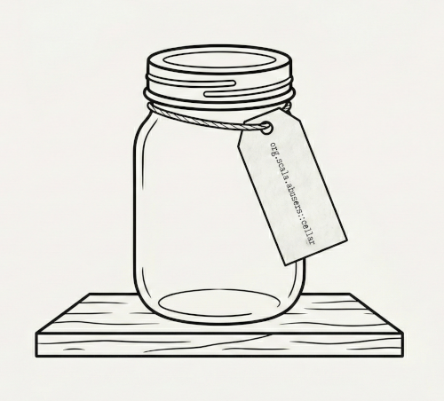

<p align="center">
  
</p>

<h1 align="center">Cellar</h1>

<p align="center">
  Look up the public API of any Maven-published JVM dependency from the terminal.
</p>

---

When a coding agent needs to call an unfamiliar library method, its options are bad: parse HTML docs (expensive, unreliable), find source on GitHub (requires knowing the URL), or hallucinate the API.

Cellar gives agents — and humans — a single shell command that returns exactly the type signatures, members, and docs needed to write correct code. Output is plain Markdown on stdout, ready to be injected into an LLM prompt with zero post-processing.

## Supported artifacts

| Format | Support |
|---|---|
| Scala 3 (TASTy) | Full — signatures, flags, companions, sealed hierarchies, givens, extensions, docstrings, source |
| Scala 2 (pickles) | Best-effort — type information may be incomplete |
| Java (.class) | Good — signatures, members, source |

## Usage

### `cellar get <coordinate> <fqn>`

Look up a single symbol — type signature, flags, members, companion, known subtypes, docstring.

```
cellar get org.typelevel:cats-core_3:2.10.0 cats.Monad
cellar get org.apache.commons:commons-lang3:3.14.0 org.apache.commons.lang3.StringUtils
```

### `cellar get-source <coordinate> <fqn>`

Fetch the source code from the published `-sources.jar`.

```
cellar get-source org.typelevel:cats-core_3:2.10.0 cats.Monad
```

### `cellar list <coordinate> <package-or-class>`

List all public symbols in a package or class. Supports `--limit N` (default: 50).

```
cellar list org.typelevel:cats-core_3:2.10.0 cats
cellar list org.typelevel:cats-core_3:2.10.0 cats.Monad
```

### `cellar search <coordinate> <query>`

Case-insensitive substring search across all symbol names. Supports `--limit N` (default: 50).

```
cellar search org.typelevel:cats-core_3:2.10.0 flatMap
cellar search io.circe:circe-core_3:0.14.6 decode
```

### `cellar deps <coordinate>`

Print the full transitive dependency tree.

```
cellar deps org.typelevel:cats-effect_3:3.5.4
```

### Coordinates

Maven coordinates must be explicit — `group:artifact:version`. The `::` shorthand is not supported.

```
org.typelevel:cats-core_3:2.10.0        # Scala 3
org.typelevel:cats-core_2.13:2.10.0     # Scala 2
org.apache.commons:commons-lang3:3.14.0 # Java
```

### Options

| Flag | Description |
|---|---|
| `--java-home <path>` | Use a specific JDK for JRE classpath |
| `-r`, `--repository <url>` | Extra Maven repository URL (repeatable) |
| `-l`, `--limit <N>` | Max results (`list` and `search` only) |

## Output conventions

- **stdout** — Markdown content (signatures, docs, source)
- **stderr** — diagnostics (warnings, truncation notices)
- **Exit 0** — success
- **Exit 1** — error

## Building

Requires JDK 17+ and [Mill](https://mill-build.org/).

```sh
# Fat JAR
./mill cli.assembly
java -jar out/cli/assembly.dest/out.jar get org.typelevel:cats-core_3:2.10.0 cats.Monad

# Native image (GraalVM)
./mill cli.nativeImage

# Wrapper script
./scripts/cellar get org.typelevel:cats-core_3:2.10.0 cats.Monad
```

### Running tests

```sh
# Publish test fixtures to local Maven first
./mill publishFixtures

# Run tests
./mill lib.test
```

## Tech stack

Scala 3, Cats Effect, fs2, [tasty-query](https://github.com/scalacenter/tasty-query), [Coursier](https://get-coursier.io/), [decline](https://ben.kirw.in/decline/), Mill.
