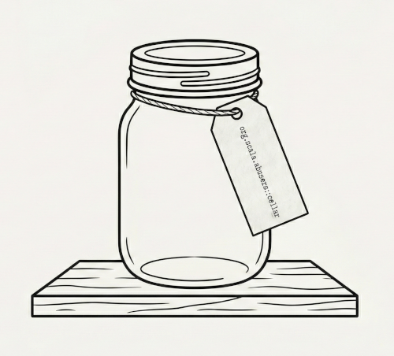

<p align="center">
  
</p>

<h1 align="center">Cellar</h1>

<p align="center">
  Look up the public API of any JVM dependency from the terminal.
</p>

---

When a coding agent needs to call an unfamiliar library method, its options are bad: parse HTML docs (expensive, unreliable), find source on GitHub (requires knowing the URL), or hallucinate the API.

Cellar gives agents — and humans — a single shell command that returns exactly the type signatures, members, and docs needed to write correct code. Output is plain Markdown on stdout, ready to be injected into an LLM prompt with zero post-processing.

## Supported artifacts

| Format | Support |
|---|---|
| Scala 3 (TASTy) | Full — signatures, flags, companions, sealed hierarchies, givens, extensions, docstrings |
| Scala 2 (pickles) | Full signatures, flags, members, companions — no docstrings (pickles carry none) |
| Java (.class) | Good — signatures, members |

## Installation

### Coursier (recommended)

If you have [Coursier](https://get-coursier.io/) installed:

```sh
cs install --contrib cellar
```

This pulls the GraalVM native binary for your platform from the latest GitHub Release. Update with `cs update cellar`.

### Nix

Run without installing:

```sh
nix run github:VirtusLab/cellar -- get-external org.typelevel:cats-core_3:2.10.0 cats.Monad
```

Install into your profile:

```sh
nix profile install github:VirtusLab/cellar
```

A Nix overlay is also available at `github:VirtusLab/cellar#overlays.default`.

### Manual

Download the native binary for your platform from https://github.com/VirtusLab/cellar/releases/latest, then extract and install:

```sh
tar xz -f cellar-*.tar.gz
sudo mv cellar /usr/local/bin/
```

To verify checksums and signatures, see [RELEASING.md](RELEASING.md).

### Development snapshots

Unstable builds of the latest development code are published as `snapshot-<sha>-<run>` [prereleases](https://github.com/VirtusLab/cellar/releases). Each run publishes a fresh, immutable prerelease and prunes the previous one, so there is always exactly one snapshot. Because immutable releases require a unique tag per build, download URLs are no longer static — resolve the newest snapshot with `gh`:

```sh
# Latest snapshot tag (requires the GitHub CLI, `gh`)
TAG=$(gh release list --repo VirtusLab/cellar --limit 100 --json tagName \
  --jq 'map(.tagName | select(startswith("snapshot-"))) | first')

# Linux x86_64 (also: linux-aarch64, macos-arm64, macos-x86_64)
gh release download "$TAG" --repo VirtusLab/cellar --pattern 'cellar-linux-x86_64.tar.gz' --output - | tar xz
sudo mv cellar /usr/local/bin/
```

Snapshots are not published to Maven Central and are not picked up by `cs install`. See [RELEASING.md](RELEASING.md#development-snapshots) for how they are produced.

## Quick start

```sh
# Look up a trait from cats
cellar get-external org.typelevel:cats-core_3:2.10.0 cats.Monad

# Look up a symbol from the current project
cellar get --module core cats.Monad

# List top-level symbols in a package
cellar list-external org.typelevel:cats-core_3:2.10.0 cats

# Search for a method name
cellar search-external org.typelevel:cats-core_3:2.10.0 flatMap

# View source code
cellar get-source org.typelevel:cats-core_3:2.10.0 cats.Monad

# Dependency tree
cellar deps org.typelevel:cats-effect_3:3.5.4
```

## Commands

Cellar has two modes: **project-aware** commands that work against your current project's classpath, and **external** commands that query arbitrary Maven coordinates.

### Project-aware commands

Run from your project root. Cellar auto-detects the build tool (Mill, sbt, or scala-cli), extracts the classpath, and queries your project's code and all its dependencies.

```sh
cellar get [--module <name>] <fqn>
cellar list [--module <name>] <package>
cellar search [--module <name>] <query>
```

- **Mill / sbt**: `--module` is required (e.g. `--module lib`, `--module core`)
- **scala-cli**: `--module` is not supported — omit it

Add `--test` to query the test-scope classpath (test dependencies and test sources):

- **sbt**: resolves `<module>/Test/fullClasspath`
- **scala-cli**: compiles with `--test`
- **Mill**: not supported — test code is a separate module, query it directly (e.g. `--module foo.test`)

The classpath is cached after the first run. Use `--no-cache` to force re-extraction.

### External commands

Query any published Maven artifact by explicit coordinate:

```sh
cellar get-external <coordinate> <fqn>
cellar list-external <coordinate> <package>
cellar search-external <coordinate> <query>
cellar get-source <coordinate> <fqn>
cellar deps <coordinate>
```

### Command reference

| Command | Description |
|---|---|
| `get` | Symbol info from the current project (signature, flags, members, docs) |
| `get-external` | Symbol info from a Maven coordinate |
| `get-source` | Source code from a published `-sources.jar` |
| `list` | List public symbols in a package/class from the current project |
| `list-external` | List public symbols from a Maven coordinate |
| `search` | Case-insensitive substring search in the current project |
| `search-external` | Case-insensitive substring search from a Maven coordinate |
| `deps` | Print the transitive dependency list |

### Maven coordinates

Coordinates use the format `group:artifact:version`. The `::` shorthand is **not** supported — use the full artifact name.

```
org.typelevel:cats-core_3:2.10.0        # Scala 3
org.typelevel:cats-core_2.13:2.10.0     # Scala 2
org.apache.commons:commons-lang3:3.14.0 # Java
```

Use `latest` as the version to automatically resolve the most recent release:

```sh
cellar get-external org.typelevel:cats-core_3:latest cats.Monad
```

### Options

| Flag | Applies to | Description |
|---|---|---|
| `--module <name>`, `-m` | project commands | Build module name (required for Mill/sbt) |
| `--no-cache` | project commands | Skip classpath cache, re-extract from build tool |
| `--test` | project commands | Use the test-scope classpath (sbt/scala-cli; not supported for Mill) |
| `--java-home <path>` | all | Use a specific JDK for JRE classpath |
| `-r`, `--repository <url>` | external commands | Extra Maven repository URL (repeatable), appended to the configured `maven.repositories`; must be an `http://`, `https://` or `file://` URL |
| `-l`, `--limit <N>` | `list`, `list-external`, `search`, `search-external` | Max results (default: 50) |
| `-l`, `--limit <N>` | `get`, `get-external` | Max members to display per section, including companion members (no default) |
| `--hide-inherited` | `get`, `get-external` | Show only members declared on the type itself |
| `--group-inherited` | `get`, `get-external` | Group members (and companion members) by declaring type with section headers |
| `-v`, `--verbose` | all except `telemetry` | Log progress and warnings to stderr |
| `--debug` | all except `telemetry` | Log detailed diagnostics and stack traces to stderr |

Private repositories: credentials from `~/.config/coursier/credentials.properties` (or
`COURSIER_CONFIG_DIR`) and the `COURSIER_CREDENTIALS` environment variable are read the same way
the coursier CLI, sbt and Mill read them, and applied to every `--repository` whose host matches.
See the [coursier credentials docs](https://get-coursier.io/docs/other-credentials).

Diagnostics are written to stderr, never stdout, so `--verbose` and `--debug` are safe to use
when piping output into a prompt. Set `CELLAR_LOG=verbose` or `CELLAR_LOG=debug` to get the same
effect without a flag — useful for debugging an installed binary. An explicit flag wins over the
environment variable.

A failed coordinate resolution always reports the locations coursier consulted — no flag needed,
since the usual question is whether it looked at your repository at all:

```console
$ cellar get-external com.example:nonexistent_3:1.2.3 foo.Bar
Could not resolve 'com.example:nonexistent_3:1.2.3'. Check that the group ID, artifact ID, and version are correct.

Tried:
  not found: /home/you/.ivy2/local/com.example/nonexistent_3/1.2.3/ivys/ivy.xml
  not found: https://repo1.maven.org/maven2/com/example/nonexistent_3/1.2.3/nonexistent_3-1.2.3.pom
```

On the `get`, `get-external` and `get-source` commands, `--verbose` also reports which lookup
strategies were tried when a symbol cannot be resolved, which is usually enough to tell "not on the
classpath" from "on the classpath but not reachable":

```console
$ cellar get-external org.typelevel:cats-core_3:2.10.0 cats.DoesNotExist99 --verbose
[cellar] could not resolve cats.DoesNotExist99
[cellar]   findStaticClass(cats.DoesNotExist99): miss
[cellar]   findStaticModuleClass(cats.DoesNotExist99): miss
[cellar]   findStaticTerm(cats.DoesNotExist99): miss
[cellar]   findStaticType(cats.DoesNotExist99): miss
[cellar]   findPackage(cats.DoesNotExist99): miss
[cellar]   nested lookup over 2 segments
[cellar]   prefix 'cats.DoesNotExist99': miss
[cellar]   no top-level root matched any prefix
```

`--debug` adds the resolved classpath, build-tool detection and cache hits, per-entry scan
failures, and stack traces. These apply to every command, including `list` and `search`.

## Configuration

Cellar loads configuration from HOCON files and environment variables. Files are loaded in order, with later values overriding earlier ones:

1. Built-in defaults
2. `~/.cellar/cellar.conf` (user-level, optional)
3. `.cellar/cellar.conf` (project-level, optional)

### Default config

```hocon
maven {
  # Extra Maven repository URLs for external commands, added to Coursier's
  # defaults (Maven Central, Ivy local)
  repositories = []
}

mill {
  # Binary to invoke when extracting Mill classpaths
  binary = "./mill"           # env: CELLAR_MILL_BINARY
}

sbt {
  # Binary to invoke when extracting sbt classpaths (e.g. "sbt", "sbtn")
  binary = "sbt"              # env: CELLAR_SBT_BINARY
  # Extra arguments passed to sbt, space-separated (e.g. "--client")
  extra-args = ""             # env: CELLAR_SBT_EXTRA_ARGS
}

starvation-checks {
  # Enable Cats Effect CPU starvation warnings (default: false).
  # Set to true during development or CI to surface warnings.
  enabled = false             # env: CELLAR_STARVATION_CHECKS_ENABLED
}

otel {
  enabled = false             # env: CELLAR_OTEL_ENABLED
  endpoint = "http://localhost:4318/v1/traces"  # env: CELLAR_OTEL_ENDPOINT
}

profiling {
  enabled = false                                 # env: CELLAR_PROFILING_ENABLED
  pyroscope-endpoint = "http://localhost:4040"    # env: CELLAR_PYROSCOPE_ENDPOINT
}
```

### Examples

Use `sbtn` instead of `sbt`:

```hocon
sbt { binary = "sbtn" }
```

Use sbt in `--client` mode:

```hocon
sbt { extra-args = "--client" }
```

Use a custom Mill wrapper:

```hocon
mill { binary = "./millw" }
```

Always resolve external coordinates through an internal repository, so `-r` is no longer needed:

```hocon
maven {
  repositories = [
    "https://artifactory.company.com/maven",
    "https://artifactory.company.com/maven-snapshots"
  ]
}
```

Maven Central and Ivy local stay available, and CLI `-r` values are appended to the configured list.
Lists replace rather than merge, so a project-level `maven.repositories` overrides the user-level
list and `repositories = []` clears it for that project. Configuration holds URLs only —
credentials come from coursier, as described above.

Or via environment: `CELLAR_SBT_BINARY=sbtn cellar get --module core cats.Monad`

## Telemetry

Cellar collects **anonymous usage telemetry** to help improve the tool. It is opt-in. On first use cellar asks you to choose before running:

- **In an interactive terminal** you're prompted inline (`[1] enable  [2] enable globally  [3] disable (default)  [4] disable globally`); once you answer, the requested command continues in the same run.
- **Non-interactively** (output piped, CI, or an AI agent) cellar withholds the command and prints a machine-readable consent request instead. The command stays withheld on every run until a choice is recorded (e.g. with `cellar telemetry disable`).

Either way, telemetry stays disabled until you explicitly enable it.

The formal data-protection terms covering this telemetry are in the [Privacy Policy](PRIVACY_POLICY.md).

### What is collected

Each command sends an OpenTelemetry trace with a root `cellar.command` span (plus child spans for hot-path operations). These are the only attributes emitted — nothing else:

| Attribute | Example | Span |
|---|---|---|
| `command.name` | `get-external` | root |
| `cellar.version` | `0.4.0` | root |
| `os.type` | `Mac OS X` | root |
| `command.success` | `true` | root |
| `error.category` | `user` or `system` (only on failure) | root |
| `error.type` | `CoordinateNotFound` (only on failure) | root |
| `installation.id` | anonymous UUID (see below) | root |
| `build.tool` | `mill`, `sbt`, etc. | `build.classpath` |

**What is never sent**: Maven coordinates, fully-qualified symbol names, search queries, error messages, stack traces, or any other user data.

### Installation ID

The installation ID is a randomly-generated UUID stored in `~/.cellar/installation_id`. It identifies your installation, not you: there is no account, no email, and no way to link it to a person. You can reset it at any time with `cellar telemetry reset-id`.

### Managing telemetry

```sh
cellar telemetry enable            # opt in for the current project
cellar telemetry enable --global   # opt in for all projects
cellar telemetry disable           # opt out for the current project
cellar telemetry disable --global  # opt out everywhere and stop prompting
cellar telemetry status            # show current status and installation ID
cellar telemetry reset-id          # generate a new anonymous installation ID
```

`enable`/`disable` write to `.cellar/cellar.conf` in the current project by default; `--global` writes to `~/.cellar/cellar.conf` instead. A project-level setting overrides the global one.

### Configuration

Telemetry can also be controlled via `~/.cellar/cellar.conf` or environment variables:

```hocon
otel {
  enabled = true                        # env: CELLAR_OTEL_ENABLED
  endpoint = "http://localhost:4318/v1/traces"  # env: CELLAR_OTEL_ENDPOINT
}

# Pyroscope JVM-agent profiles linked to traces (local-dev only; the production
# stack does not accept profiles). Only active when running from the JAR.
profiling {
  enabled = true                                  # env: CELLAR_PROFILING_ENABLED
  pyroscope-endpoint = "http://localhost:4040"    # env: CELLAR_PYROSCOPE_ENDPOINT
}
```

## Output conventions

- **stdout** — Markdown content (signatures, docs, source)
- **stderr** — diagnostics (warnings, truncation notices)
- **Exit 0** — success
- **Exit 1** — error

## Example output

<details>
<summary><code>cellar get-external org.typelevel:cats-core_3:2.10.0 cats.Monad</code></summary>

    ## cats.Monad
    ```scala
    trait Monad[F] extends FlatMap[F] with Applicative[F]
    ```
    Monad.
    Allows composition of dependent effectful functions.

    **Flags:** abstract
    **Origin:** cats.Monad
    **Members:**
    ```scala
    def pure[A](x: A): F[A]
    def flatMap[A, B](fa: F[A])(f: A => F[B]): F[B]
    def flatten[A](ffa: F[F[A]]): F[A]
    def untilM[G[_], A](f: F[A])(cond: => F[Boolean])(implicit G: Alternative[G]): F[G[A]]
    def compose[G[_]](implicit evidence$1: Applicative[G]): Applicative[[α] =>> F[G[α]]]
    ...
    ```

</details>

<details>
<summary><code>cellar list-external org.typelevel:cats-core_3:2.10.0 cats --limit 5</code></summary>

    object Eval$
    trait ComposedContravariantCovariant[F, G] extends Contravariant[[α] =>> F[G[α]]]
    object Later$
    object Show$
    trait EvalSemigroup[A] extends Semigroup[Eval[A]]
    Note: results truncated at 5. Use --limit to increase.

</details>

<details>
<summary><code>cellar search-external org.typelevel:cats-core_3:2.10.0 flatMap --limit 3</code></summary>

    cats.FlatMap — object FlatMap$
    cats.FlatMap — trait FlatMap[F] extends Apply[F] with FlatMapArityFunctions[F]
    cats.FlatMap$ — object FlatMap$
    Note: results truncated at 3. Use --limit to increase.

</details>

## Using cellar with Claude Code

### As a plugin (recommended)

Install cellar as a Claude Code plugin for auto-updates:

```sh
/plugin marketplace add virtuslab/cellar
/plugin install cellar@virtuslab-cellar
```

Claude will automatically have access to the `/cellar:cellar` skill and know when to use it.

### Without the plugin

If you don't want the plugin, copy the skill into your project (or into
`~/.claude/skills/` to make it available everywhere):

```sh
mkdir -p .claude/skills/cellar
curl -o .claude/skills/cellar/SKILL.md \
  https://raw.githubusercontent.com/VirtusLab/cellar/main/skills/cellar/SKILL.md
```

[`skills/cellar/SKILL.md`](skills/cellar/SKILL.md) is the single source of truth
for the agent-facing instructions — it stays in sync with the CLI, so prefer it
over pasting a hand-written command list into `CLAUDE.md`.

## Building from source

Requires JDK 17+ and [Mill](https://mill-build.org/).

```sh
# Fat JAR
./mill cli.assembly
java -jar out/cli/assembly.dest/out.jar get-external org.typelevel:cats-core_3:2.10.0 cats.Monad

# Native image (GraalVM)
./mill cli.nativeImage

```

### Running tests

```sh
# Publish test fixtures to local Maven first
./mill publishFixtures

# Run tests
./mill lib.test
```

### Linting

Scalafix runs `OrganizeImports` and a `DisableSyntax` rule that bans `java.nio.file.{Files, Path, Paths}` and `java.io.File` in favour of `fs2.io.file`. Configuration lives in [`.scalafix.conf`](.scalafix.conf).

```sh
# Report violations (what CI runs)
./mill _.fix --check

# Rewrite imports in place and report the remaining violations
./mill _.fix
```

Where JDK interop genuinely requires `java.nio` (`JreClasspath`, for instance), suppress the rule with `// scalafix:off DisableSyntax.javaNioFile` above the `package` clause and say why.

### Installing a local build with Nix

```sh
./mill cli.nativeImage && nix profile install --impure .#dev
```

## Tech stack

Scala 3, Cats Effect, fs2, [tasty-query](https://github.com/scalacenter/tasty-query), [Coursier](https://get-coursier.io/), [decline](https://ben.kirw.in/decline/), Mill.

## License

[MPL-2.0](LICENSE)
